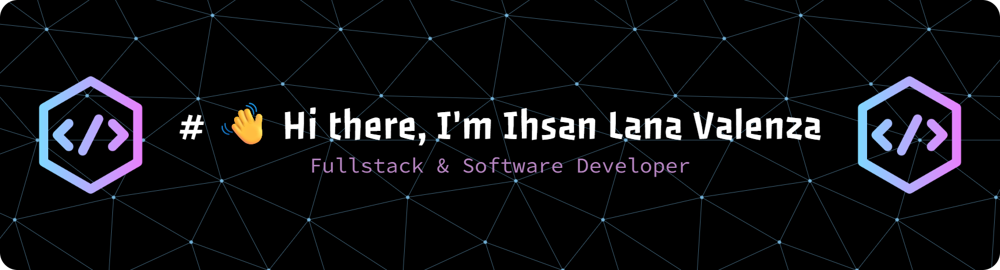

# My Github Profile Ihsan Lana Valenza

I'm a fullstack web developer passionate about building impactful digital solutions — from agricultural e-commerce platforms to flight monitoring systems. I craft elegant code, meaningful user experiences, and scalable systems that solve real-world problems.

---

## 🌐 Socials:
   

## 💻 Tech Stack:
                       

---

<!-- Proudly created with GPRM ( https://gprm.itsvg.in ) -->
## 🧑‍💼 Internship Experience

### 🚀 AirNav Indonesia — Software Development Intern  
Built a real-time aircraft navigation system using cutting-edge tech:  
- **Frontend**: Nuxt 3, Vue.js  
- **Backend**: Node.js  
- **Language**: TypeScript  
Created a flight monitoring dashboard for AirNav’s internal use, enabling more efficient air traffic visualization and system reliability.

---

## 💼 Currently Working On

- Laravel 11 + Vite + TailwindCSS platforms for startup and SME clients  
- Vue.js dashboards with real-time data flow for smart farming and logistics  
- Freelance projects: company profiles, payment tracking systems, disaster research sites

---

## 🤝 Looking to Collaborate On

- Community-driven apps with social impact  
- Academic systems for universities and research centers  
- Tech-powered startup ideas needing fullstack execution

---

## 🔍 Seeking Insights On

- How to showcase developer portfolios more effectively  
- Leveraging GitHub Projects & LinkedIn for career growth  
- Privacy-first tools for digital collaboration

---

## 📚 Currently Learning

- Advanced Laravel 11 features: service providers, middleware, API auth  
- UI polishing with TailwindCSS and transitions  
- Professional bilingual communication (English 🇬🇧 + Japanese 🇯🇵)

---

## 💬 Ask Me About

- Nuxt 3 + Node integration for real-time systems  
- PHP quirks, file handling & Git push protection  
- Building custom CMS or accounting systems  
- How to back up hospital websites securely

---

## 🔧 Tech Stack

- **Frontend**: Vue.js, Nuxt 3, TailwindCSS, Bootstrap  
- **Backend**: Laravel, Node.js, CodeIgniter  
- **Database**: MySQL, Mongo DB, PostgreSQL
- **DevOps**: Docker, CI/CD pipelines
- **Cloud**: AWS, DigitalOcean, Firebase
- **Version Control**: Git, GitHub, GitLab
- **Deployment**: Vercel, Netlify, DigitalOcean
- **APIs**: RESTful, GraphQL
- **Testing**: PHPUnit, Cypress 
- **Language**: TypeScript, PHP, JavaScript  
- **Tools**: Git, Vite, NPM

---

## 🔗 Let's Connect

- 🌐 Portfolio: *[san_lana.dev.io](san-lana.dev.io)*  
- 💼 LinkedIn:[linkedin.com/in/ihsanlana864](https://www.linkedin.com/in/ihsanlanavakenza) 
- 📧 Email: *ihsanlana864@gmail.com | Need a professional message or intro? Just ask!*
- 🌍 GitHub: [github.com/ihsanlanavalenza](https://github.com/ihsanlanavalenza)
- 📸 Instagram: [instagram.com/ihsanlv_](https://www.instagram.com/ihsanlv_)
---

